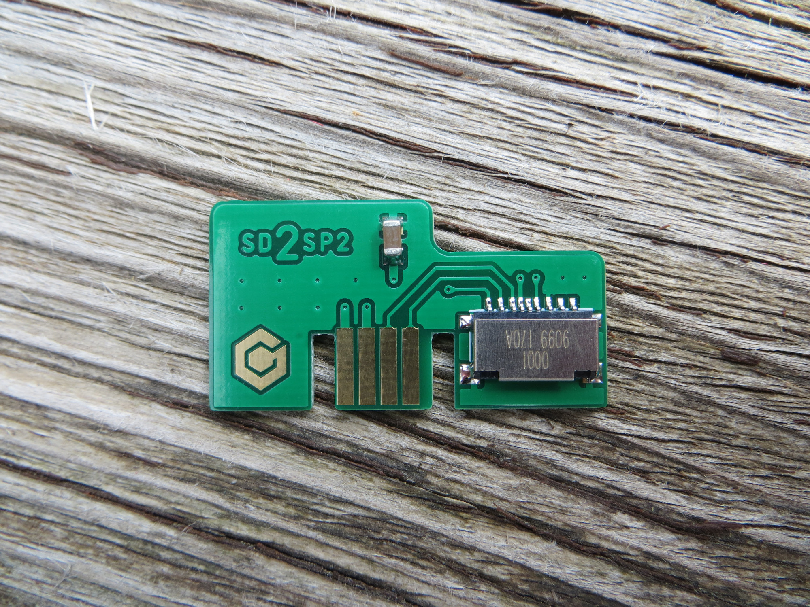

# Nintendo GameCube SD2SP2 MicroSD Card Adapter

An aesthetically upgraded version of Citrus3000psi's SD2SP2 v1.2a.

Read more about this project from the creator of the original https://github.com/citrus3000psi/SD2SP2

## Manufacturing

- 1.2mm PCB thickness.
- ENIG finish.

## Version History

- v1.2b - 05/04/2021

## Donate

Working on designs to release for free can be both time consuming and expensive. If you like what I do, a small donation will go a long way in helping me continue to serve the modding community as best as I can, with many more free and original guides, designs, and ideas to come.

